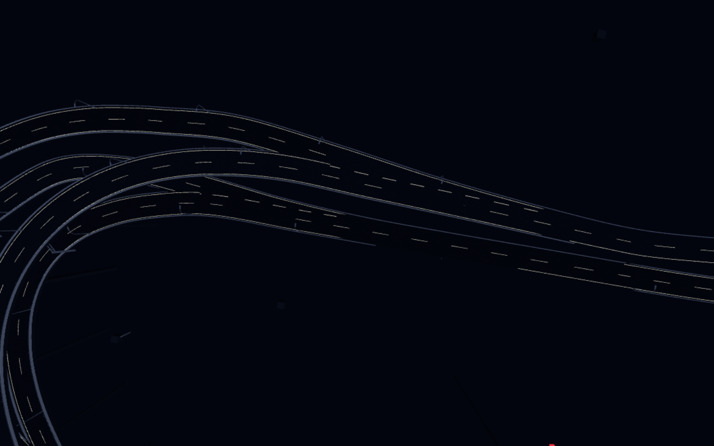
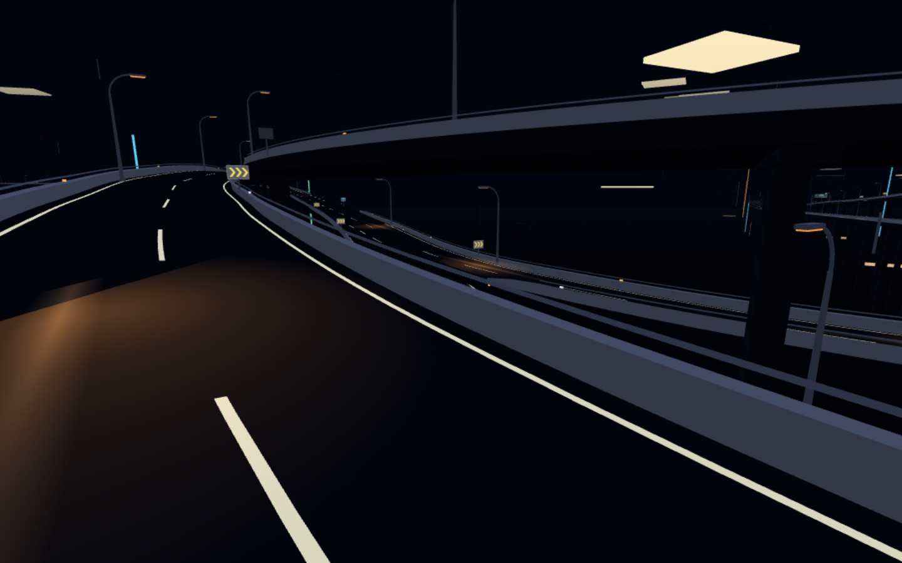
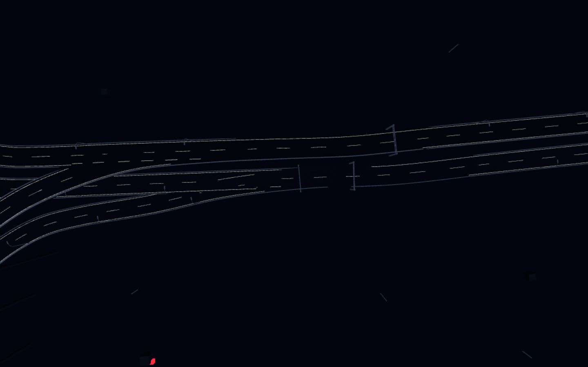
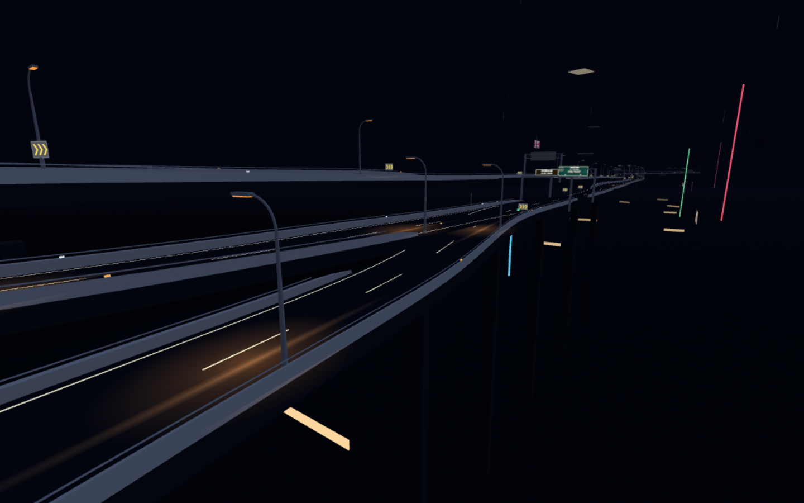
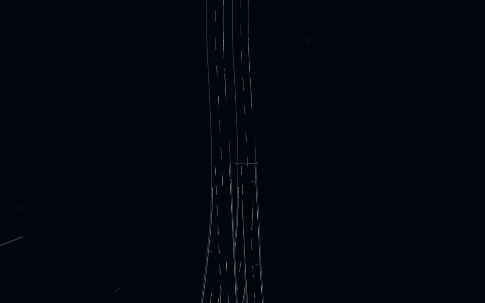
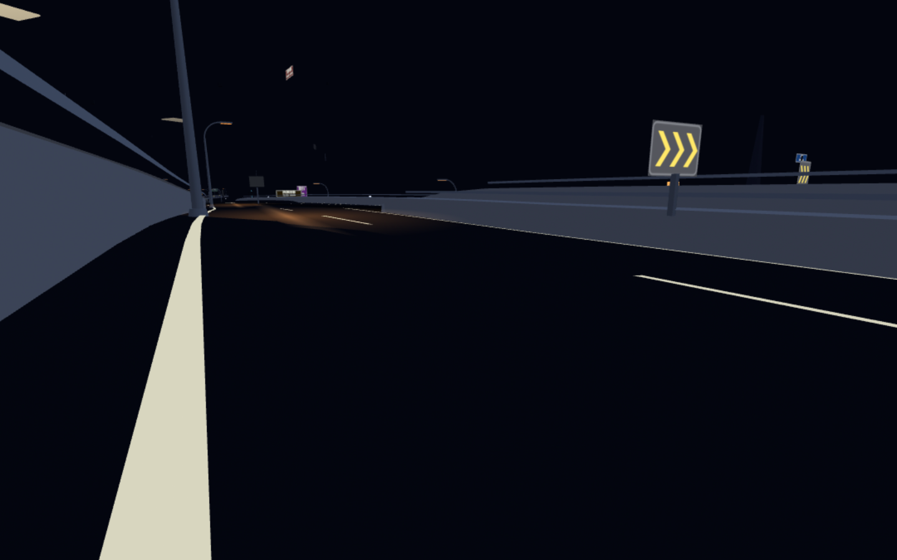
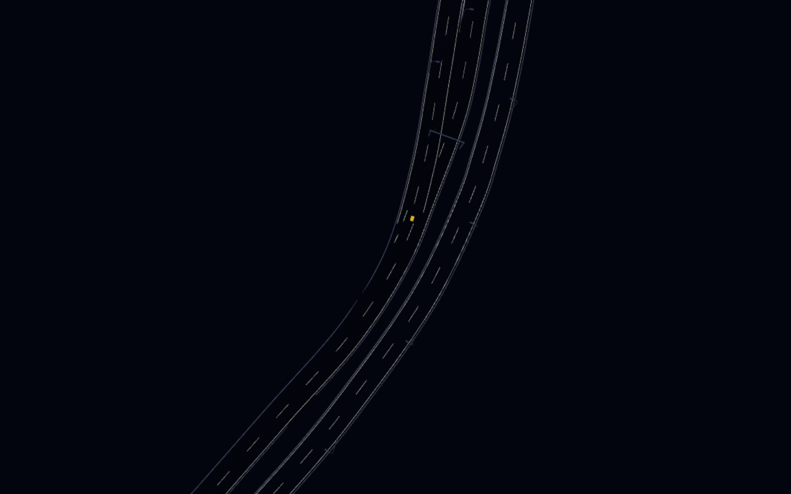
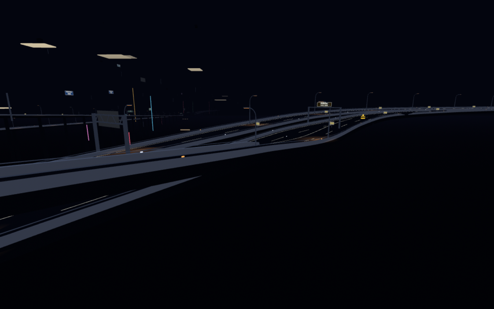
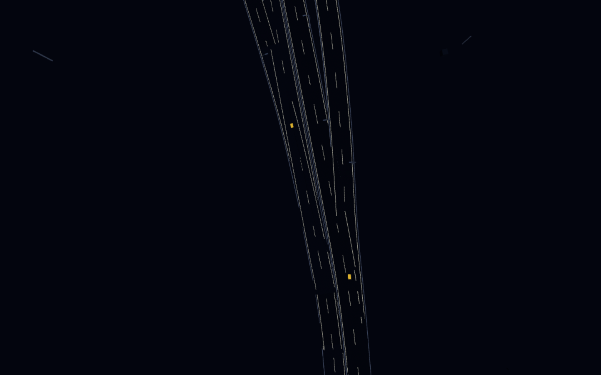
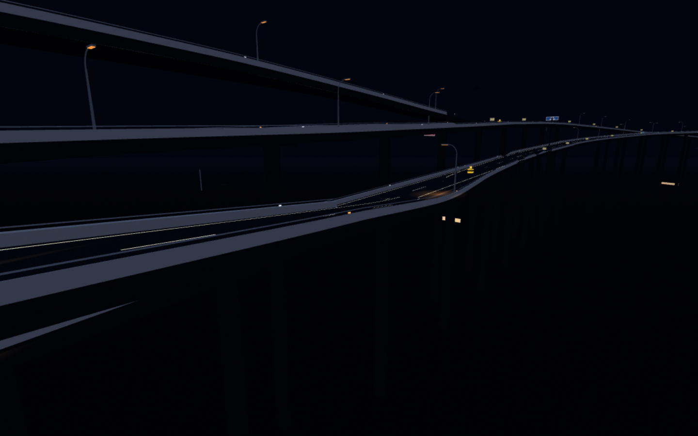

# P2 Same-Level 2+2 Merge Candidate Report

Generated from runtime geometry on verified `origin/main` base
`1a80b1b2be8f7e4e25b923de3a79413c302b7e91`. This report covers every graph connection
whose operation is merge and whose host and branch both have exactly two
lanes. Rows are sampled in actual branch travel order toward the merge, not by
reversing P1 animation phases.

## Result

No genuine same-level 2+2 merge exists in the current source network. All five
candidates either overlap while owned by different vertical decks, fail to
connect at the transfer, or also contain source curvature/tangent defects.
Creating P2 at any of them would violate the explicit same-level and
no-ramp-over-mainline gates. The closest case, `J5`, still has a 1.033 m
deck-edge split before lateral separation plus a 54.04 deg/100 m source curve.

No road, junction geometry, progressive prototype, or developer-map marker is
modified by this audit. The validated `J2` diverge therefore remains exactly
as received, and the requested P4-to-P1/developer-map cleanup is intentionally
not applied because the brief says to stop after the candidate report when no
valid P2 exists.

## Ranked candidates

| Rank | Junction | Traffic route pair | World X, Y, Z | Approach m | Parallel m | Max absorption m | Edge ΔY m | Grade Δ % | Bank Δ ° | Tangent Δ ° | Curvature °/100 m | Rejection |
| ---: | --- | --- | --- | ---: | ---: | ---: | ---: | ---: | ---: | ---: | ---: | --- |
| 1 | `J5:merge:c1_0:r6_3:end` | `r6_3 -> c1_0` | 595.11, 51.64, 463.91 | 1756.43 | 140 | 160 | 1.033 | 3.65 | 5.61 | 19.98 | 54.04 | 3 overlap samples lose deck ownership before lateral separation; 1.033 m maximum deck-edge separation; 3.65% maximum relative grade; 19.98 deg maximum tangent mismatch; 54.04 deg/100 m source curvature |
| 2 | `J1:merge:c1_2:c1_6:end` | `c1_6 -> c1_2` | -1144.45, 50.99, -3025.86 | 203.7 | 104 | 104 | 1.931 | 8.47 | 3.94 | 11.38 | 23.54 | 9 overlap samples lose deck ownership before lateral separation; 1.931 m maximum deck-edge separation; 8.47% maximum relative grade; deck ownership disconnects and reconnects inside the interaction |
| 3 | `J0:merge:c1_0:c1_3:end` | `c1_3 -> c1_0` | -897.45, 52.37, -2806.42 | 283.31 | 128 | 124 | 2.62 | 8.34 | 6.97 | 11.02 | 18.32 | 9 overlap samples lose deck ownership before lateral separation; 2.620 m maximum deck-edge separation; 8.34% maximum relative grade; measured source span never reaches clean lateral separation; deck ownership disconnects and reconnects inside the interaction |
| 4 | `J33:merge:r6_0:ramp_22:end` | `ramp_22 -> r6_0` | 962.38, 60.26, 152.46 | 492.38 | 128 | 124 | 2.924 | 13.05 | 3.8 | 9.99 | 56.31 | 19 overlap samples lose deck ownership before lateral separation; 2.924 m maximum deck-edge separation; 13.05% maximum relative grade; 56.31 deg/100 m source curvature; measured source span never reaches clean lateral separation |
| 5 | `J16:merge:r1_3:ramp_10:end` | `ramp_10 -> r1_3` | -1919.32, 46.54, -12267.59 | 1889.31 | 168 | 136 | 2.507 | 12.76 | 5.73 | 6.45 | 13.83 | transfer is not one shared render/collision deck; 12 overlap samples lose deck ownership before lateral separation; 2.507 m maximum deck-edge separation; 12.76% maximum relative grade; measured source span never reaches clean lateral separation; deck ownership disconnects and reconnects inside the interaction |

## Runtime geometry in travel order

`Shared deck` is the same emitted road-surface and collision-deck ownership
decision used by production. A `no` while the paved envelopes overlap in
plan is a vertical/multi-level interaction, not an opening available to a
progressive four-lane merge.

### 1. `J5:merge:c1_0:r6_3:end` — `r6_3 -> c1_0`

| Branch s | Host s | Centre ΔY m | Edge ΔY m | Tangent ° | Grade Δ % | Bank Δ ° | Plan overlap | Shared deck |
| ---: | ---: | ---: | ---: | ---: | ---: | ---: | --- | --- |
| 1756.43 | 1386.09 | -1.696 | 1.696 | 18.95 | 3.55 | 0 | no | no |
| 1776.43 | 1404.32 | -0.515 | 0.733 | 13.87 | 2.16 | 2.5 | yes | no |
| 1796.43 | 1423.36 | -0.136 | 0.601 | 6.75 | 0.52 | 5.43 | yes | yes |
| 1816.43 | 1442.13 | -0.008 | 0.466 | 3.48 | 0.15 | 5.35 | yes | yes |
| 1836.43 | 1462.58 | 0.047 | 0.35 | 2.6 | 0.10 | 3.47 | yes | yes |
| 1856.43 | 1482.6 | 0.049 | 0.308 | 0.61 | 0.03 | 3.04 | yes | yes |
| 1876.43 | 1502.58 | 0.052 | 0.397 | 0.33 | 0.02 | 4.07 | yes | yes |
| 1896.43 | 1522.91 | 0.057 | 0.277 | 0.07 | 0.01 | 2.6 | yes | yes |
| 1916.43 | 1542.66 | 0.026 | 0.066 | 0 | 0.39 | 0.48 | yes | yes |
| 1936.43 | 1560.26 | -0.004 | 0.23 | 0.02 | 0.07 | 2.67 | yes | yes |
| 1940.43 | 1564.62 | 0 | 0.256 | 0.05 | 0.10 | 3.01 | yes | yes |

Decision: **REJECT** — 3 overlap samples lose deck ownership before lateral separation; 1.033 m maximum deck-edge separation; 3.65% maximum relative grade; 19.98 deg maximum tangent mismatch; 54.04 deg/100 m source curvature.

### 2. `J1:merge:c1_2:c1_6:end` — `c1_6 -> c1_2`

| Branch s | Host s | Centre ΔY m | Edge ΔY m | Tangent ° | Grade Δ % | Bank Δ ° | Plan overlap | Shared deck |
| ---: | ---: | ---: | ---: | ---: | ---: | ---: | --- | --- |
| 203.7 | 10756.41 | -2.191 | 2.191 | 8.69 | 4.98 | 1.72 | no | no |
| 219.7 | 10772.48 | -1.106 | 1.182 | 11.38 | 8.47 | 0.79 | yes | no |
| 235.7 | 10787.62 | -0.072 | 0.27 | 8.56 | 4.84 | 2.53 | yes | yes |
| 251.7 | 10803.84 | 0.285 | 0.517 | 5.42 | 0.08 | 2.74 | yes | no |
| 267.7 | 10820.46 | 0.097 | 0.429 | 3.42 | 1.17 | 3.94 | yes | yes |
| 283.7 | 10835.91 | 0.006 | 0.234 | 1.16 | 0.08 | 2.72 | yes | yes |
| 299.7 | 10851.74 | 0.015 | 0.224 | 0.17 | 0.03 | 2.47 | yes | yes |
| 315.7 | 10868.83 | 0.002 | 0.086 | 0.5 | 0.09 | 0.99 | yes | yes |
| 331.7 | 10883.65 | 0.001 | 0.054 | 0.05 | 0.01 | 0.62 | yes | yes |
| 347.7 | 10896.44 | -0.001 | 0.227 | 0.05 | 0.02 | 2.66 | yes | yes |
| 351.7 | 10900.34 | 0 | 0.279 | 0.02 | 0.04 | 3.28 | yes | yes |

Decision: **REJECT** — 9 overlap samples lose deck ownership before lateral separation; 1.931 m maximum deck-edge separation; 8.47% maximum relative grade; deck ownership disconnects and reconnects inside the interaction.

### 3. `J0:merge:c1_0:c1_3:end` — `c1_3 -> c1_0`

| Branch s | Host s | Centre ΔY m | Edge ΔY m | Tangent ° | Grade Δ % | Bank Δ ° | Plan overlap | Shared deck |
| ---: | ---: | ---: | ---: | ---: | ---: | ---: | --- | --- |
| 283.31 | 11176.3 | -2.62 | 2.62 | 11.02 | 8.13 | 5.25 | yes | no |
| 303.31 | 11195.82 | -0.673 | 1.232 | 8.71 | 6.42 | 6.97 | yes | yes |
| 323.31 | 11215.84 | 0.172 | 0.595 | 5.28 | 0.26 | 5.04 | yes | no |
| 343.31 | 11234.34 | 0.077 | 0.314 | 3.26 | 0.78 | 2.8 | yes | yes |
| 363.31 | 11255.44 | 0.018 | 0.309 | 1.03 | 0.14 | 3.45 | yes | yes |
| 383.31 | 11278.31 | -0.016 | 0.218 | 0.45 | 0.02 | 2.39 | yes | yes |
| 403.31 | 11295.83 | 0.007 | 0.165 | 0.13 | 0.11 | 1.85 | yes | yes |
| 423.31 | 11315.66 | 0.004 | 0.009 | 0.05 | 0.06 | 0.06 | yes | yes |
| 443.31 | 11335.05 | -0.001 | 0.202 | 0.05 | 0.02 | 2.37 | yes | yes |
| 447.31 | 11339.45 | 0 | 0.26 | 0.06 | 0.00 | 3.06 | yes | yes |

Decision: **REJECT** — 9 overlap samples lose deck ownership before lateral separation; 2.620 m maximum deck-edge separation; 8.34% maximum relative grade; measured source span never reaches clean lateral separation; deck ownership disconnects and reconnects inside the interaction.

### 4. `J33:merge:r6_0:ramp_22:end` — `ramp_22 -> r6_0`

| Branch s | Host s | Centre ΔY m | Edge ΔY m | Tangent ° | Grade Δ % | Bank Δ ° | Plan overlap | Shared deck |
| ---: | ---: | ---: | ---: | ---: | ---: | ---: | --- | --- |
| 492.38 | 599.01 | 2.924 | 2.924 | 0.88 | 12.67 | 3.41 | yes | no |
| 516.38 | 622.95 | 0.737 | 1 | 1.86 | 7.24 | 3.39 | yes | no |
| 540.38 | 647.95 | 0.306 | 0.316 | 9.99 | 1.87 | 0.44 | yes | no |
| 564.38 | 671.67 | 0.207 | 0.228 | 5.45 | 0.10 | 0 | yes | no |
| 588.38 | 695.92 | 0.053 | 0.059 | 2.44 | 0.01 | 0 | yes | yes |
| 612.38 | 719.86 | 0.01 | 0.012 | 0.6 | 0.11 | 0 | yes | yes |
| 636.38 | 743.8 | -0.025 | 0.057 | 1.48 | 0.27 | 0.37 | yes | yes |
| 660.38 | 767.82 | 0.004 | 0.106 | 0.46 | 0.00 | 1.3 | yes | yes |
| 684.38 | 791.68 | 0 | 0.202 | 0.02 | 0.01 | 2.56 | yes | yes |
| 692.38 | 799.51 | 0 | 0.299 | 0.03 | 0.02 | 3.8 | yes | yes |

Decision: **REJECT** — 19 overlap samples lose deck ownership before lateral separation; 2.924 m maximum deck-edge separation; 13.05% maximum relative grade; 56.31 deg/100 m source curvature; measured source span never reaches clean lateral separation.

### 5. `J16:merge:r1_3:ramp_10:end` — `ramp_10 -> r1_3`

| Branch s | Host s | Centre ΔY m | Edge ΔY m | Tangent ° | Grade Δ % | Bank Δ ° | Plan overlap | Shared deck |
| ---: | ---: | ---: | ---: | ---: | ---: | ---: | --- | --- |
| 1889.31 | 10173.82 | 2.507 | 2.507 | 5.94 | 12.76 | 0.91 | yes | no |
| 1913.31 | 10197.95 | 0.051 | 0.111 | 5.64 | 5.67 | 0.48 | yes | yes |
| 1937.31 | 10221.81 | -0.051 | 0.412 | 5.04 | 1.98 | 4.4 | yes | yes |
| 1961.31 | 10245.86 | 0.063 | 0.494 | 2.66 | 0.04 | 5.34 | yes | yes |
| 1985.31 | 10268.94 | 0.091 | 0.468 | 1.75 | 0.04 | 4.75 | yes | yes |
| 2009.31 | 10294.94 | 0.026 | 0.18 | 0.57 | 0.59 | 2.02 | yes | yes |
| 2033.31 | 10317.83 | 0.258 | 0.258 | 0.2 | 0.24 | 0 | yes | no |
| 2057.31 | 10341.77 | 0.095 | 0.17 | 0.14 | 1.42 | 0.95 | yes | yes |
| 2081.31 | 10365.9 | -0.002 | 0.378 | 0.02 | 0.03 | 4.77 | yes | no |

Decision: **REJECT** — transfer is not one shared render/collision deck; 12 overlap samples lose deck ownership before lateral separation; 2.507 m maximum deck-edge separation; 12.76% maximum relative grade; measured source span never reaches clean lateral separation; deck ownership disconnects and reconnects inside the interaction.

## Candidate order

1. `J5` is closest by connected length and height, but is still vertically
   split before lateral separation and has the worst unacceptable source kink
   among the top three.
2. `J1` has less vertical separation than `J0`, but its deck disconnects
   and reconnects inside the overlap.
3. `J0` has useful length but reaches a 2.620 m deck split, an 8.34% relative
   grade, and never reaches clean lateral separation in the measured span.
4. `J33` offers length but spends 72 m of overlap on a different deck and
   reaches a 2.924 m split with 13.05% relative grade.
5. `J16` is not a shared render/collision deck at the transfer itself, so it
   cannot define the final stable host handoff.

## Stop condition

The requested P2 topology, lane mapping, marking/rail ownership, physics probe,
visual matrix, developer-map two-pin state, and full regression/performance
suite are not fabricated for an invalid location. Work stops at Phase 1 as
directed by the brief. A future P2 requires corrected/new source geometry that
provides a real same-level 2+2 merge; vertical merge support remains out of
scope.
